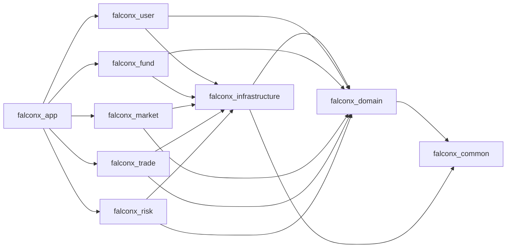

# FalconX 架构深化计划（边界图 + 路线图）

## 目标
在不推倒现有数据库基线的前提下，明确一期阶段的模块 owner、依赖方向与跨模块协作规则，并给出 `market/trade/risk` 从 0 到可运行闭环的实施路径。

## 现状基线（已确认）
- 业务 Java 代码已按“数据库优先重建”策略清空，后续按新边界重建。
- `market/trade/risk` 模块存在但暂无业务实现。
- 数据库核心表已在迁移中定义：`t_order`、`t_position`、`t_trade`、`t_risk_config`、`t_liquidation_log` 等。
- 基础设施中 MySQL/Redis/Flyway 已实际使用；Kafka/WebSocket/Web3 主要为声明与预留。

## 一、模块职责与依赖边界图

### 1) 模块 owner 规则
- [pom.xml](pom.xml)
- [docs/database/falconx一期数据库设计.md](docs/database/falconx一期数据库设计.md)
- [falconx-app/src/main/resources/db/migration/V1__init_schema.sql](falconx-app/src/main/resources/db/migration/V1__init_schema.sql)

定义 owner：
- `user`：身份认证、登录态、账号状态（不拥有资金账户写入）。
- `fund`：账户余额、冻结、保证金、资金流水唯一 owner。
- `market`：标记价/行情快照/品种元数据读取。
- `trade`：订单受理、成交编排、持仓生命周期编排。
- `risk`：下单前风控、持仓风控、强平决策与执行触发。

关键约束：
- 禁止跨模块直接操作非 owner 模块核心表（尤其 `user -> t_account`）。
- 所有资金变更统一经 `fund` 服务接口。
- `trade` 编排调用 `fund/risk/market`，但不拥有资金和风控参数最终写入权。

### 2) 依赖方向（建议）

说明：
- 维持单体多模块部署，但通过“owner + 接口”约束实现逻辑解耦。
- 若后续接 Kafka，可将跨模块同步调用逐步替换为事件协作，不改变 owner 规则。

### 3) 边界收敛改造点（优先）
- 将“注册后创建默认账户”从 `user` 直写迁移为调用 `fund` 提供的开户能力。
- 在 `fund` 内固化统一资金状态机语义：`balance/frozen/margin_used`。
- 为 `trade` 预留明确应用服务接口，而不是直接依赖 mapper。

## 二、一期 trade/risk/market 落地路线图

### Milestone A：可下单最小闭环（先跑通）
目标：完成“下单 -> 风控校验 -> 冻结保证金/扣费 -> 成交 -> 建仓”主链路。

涉及文件重点：
- [falconx-trade](falconx-trade)
- [falconx-risk](falconx-risk)
- [falconx-market](falconx-market)
- [falconx-app/src/main/resources/db/migration/V1__init_schema.sql](falconx-app/src/main/resources/db/migration/V1__init_schema.sql)

任务：
- `market`：提供 symbol 配置读取 + 当前标记价读取接口（可先 DB/Redis）。
- `risk`：实现下单前校验（杠杆上限、最小名义价值、可用余额、用户/平台头寸上限）。
- `trade`：实现下单应用服务与状态流转：`pending -> filled/rejected`。
- `fund`：将冻结/扣费接口标准化为可被 `trade` 调用的稳定契约。
- `market`：预留报价适配器接口，为后续接入 Tiingo Forex WebSocket 做准备。

验收：
- 单用户市价开仓成功，相关表一致落账（`t_order/t_position/t_trade/t_ledger`）。

### Milestone B：平仓与盈亏结算闭环
目标：完成“平仓 -> 释放保证金 -> 已实现盈亏入账 -> 仓位关闭”。

任务：
- `trade`：补平仓命令与仓位状态迁移。
- `fund`：统一 `releaseMarginWithPnl` 结算语义并完善边界校验。
- `risk`：加入平仓前基本校验（仓位状态、数量合法性）。

验收：
- 手动平仓后资金与流水一致，持仓状态正确变更为 `closed`。

### Milestone C：风控与强平基础能力
目标：形成最小可用风险闭环（维持保证金 + 强平）。

任务：
- `risk`：实现维持保证金检查逻辑与强平触发器（可先定时扫描）。
- `trade/fund`：实现强平执行路径及资金结算。
- 写入 `t_liquidation_log`，可追溯强平原因和价格。

验收：
- 价格触发下能自动强平并保证账务一致。

### Milestone D：实时与异步化（按需）
目标：提升可扩展性，不阻塞一期主流程上线。

任务：
- 接入 Tiingo Forex WebSocket 作为一期外汇报价主来源。
  - 官方文档地址：`https://www.tiingo.com/documentation/websockets/forex`
  - 密钥使用方式：前期放在项目内 Profile 配置文件中，生产阶段再切换为外部配置。
  - 接入形态：`market` 内新增 `QuoteProvider -> TiingoForexWebSocketClient -> RedisQuoteCache` 链路。
  - 输出统一标准报价对象：`symbol / bid / ask / mid / ts / source`。
  - Redis 仍作为交易与风控读取的唯一运行时价格来源，`trade/risk` 不直接读外部 WS。
  - 根据 Tiingo 官方条款，数据使用边界先按“内部业务使用”理解；若后续涉及对外再分发，需单独复核许可。
- 增加报价降级策略：
  - Tiingo 连接中断时，报价状态标记为 stale。
  - 价格超时后，开仓拒单，平仓与强平按策略处理。
- 增加本地联调约束：
  - 开发环境支持脚本注入测试价，不强依赖外部 WS 在线。
- 引入 WebSocket 推送持仓/订单变动。
- 逐步把关键事件（订单成交、仓位变化、强平）抽象为 Kafka 事件。
- Web3 入金确认流程从“表结构预留”推进到“链上监听 + 入账编排”。

验收：
- 读写压力上升时，主交易链路仍可保持一致性和可观测性。

## 三、架构守护规则（实施时同步落地）
- 任何资金变更必须可在 `t_ledger` 追溯。
- 所有跨模块协作优先走服务接口，不直接越权写表。
- 先保证一致性和闭环，再做异步和高并发优化。
- 每个里程碑必须带最小回归测试集（资金、下单、平仓、强平）。

## 四、交付物清单
- 模块职责说明（owner 文档）
- 交易主链路时序图（开仓/平仓/强平）
- 每个里程碑的 API 与表变更清单
- 最小测试矩阵与验收脚本
