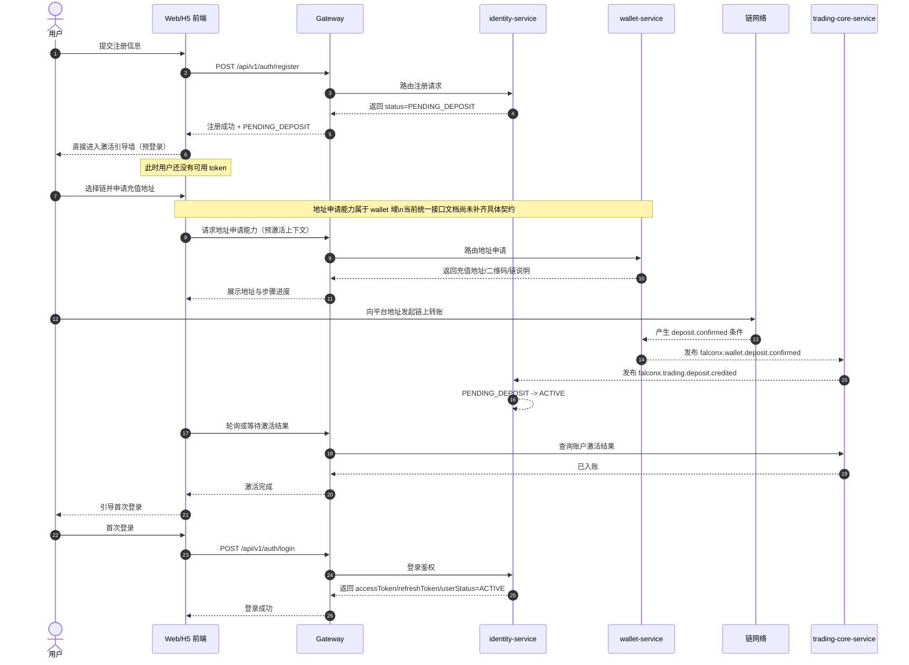
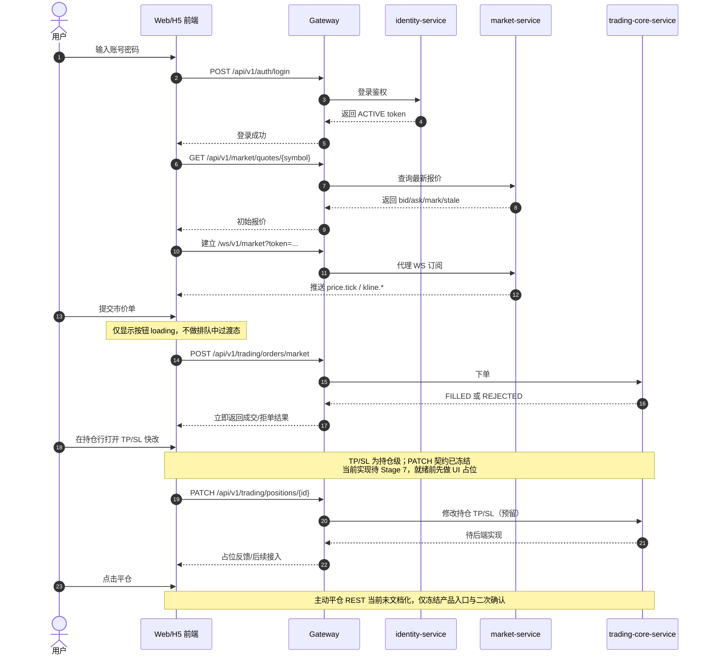
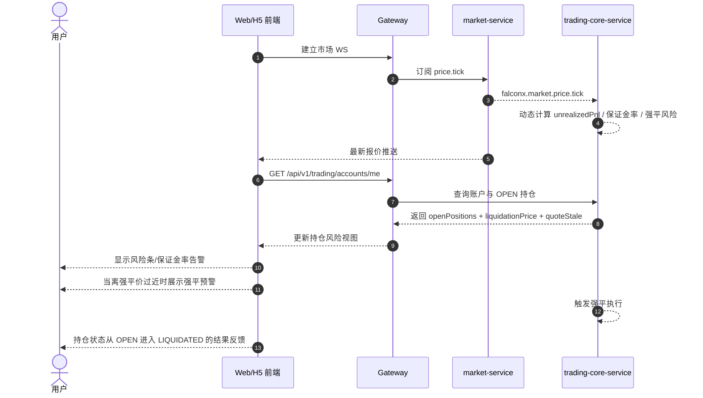
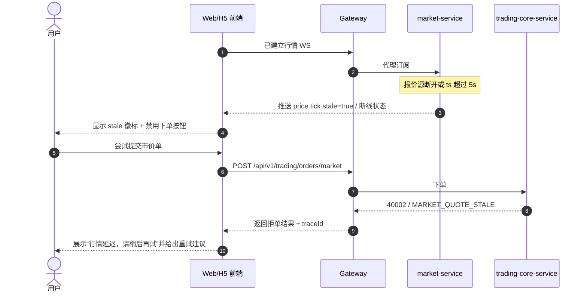
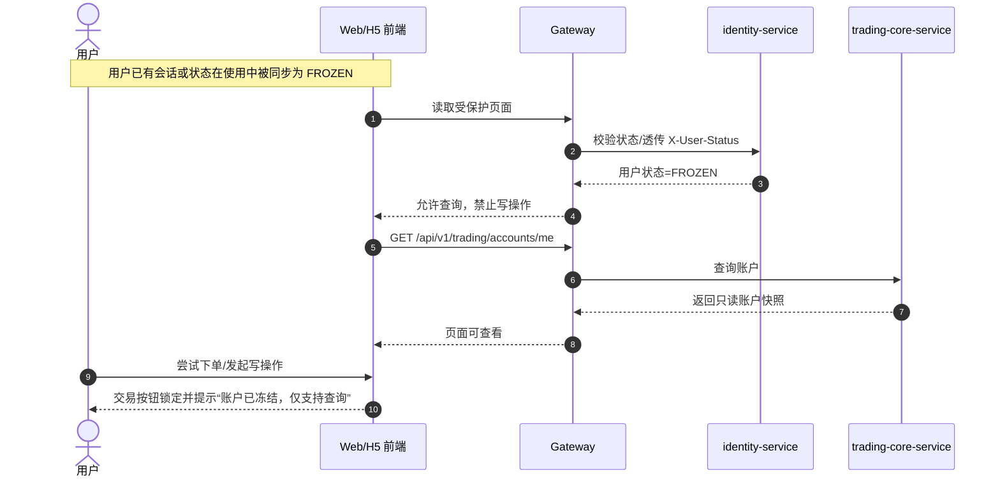
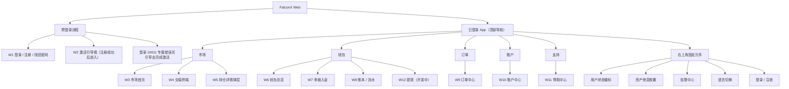
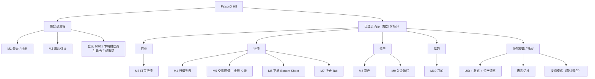

# FalconX v1 产品方案与信息架构

## 本文件与规范的关系

本文件是 `docs/design/codex-prompt.md` 在 **Stage B** 的 PRD 交付，负责把 FalconX v1 的产品目标、用户旅程、信息架构、页面范围、指标与埋点冻结为前端设计输入。它不扩展后端契约，不替后端补接口，只在现有正式规范内完成产品表达。

直接依赖的正式规范如下：

- [设计主 Prompt](./codex-prompt.md)
- [FalconX 统一接口文档](../api/FalconX统一接口文档.md)
- [REST 接口规范](../api/REST接口规范.md)
- [WebSocket 接口规范](../api/WebSocket接口规范.md)
- [安全规范](../security/安全规范.md)
- [状态机规范](../domain/状态机规范.md)
- [事务与幂等规范](../architecture/事务与幂等规范.md)
- [FalconX 一期网关-服务-数据库架构方案](../architecture/falconx一期网关-服务-数据库架构方案.md)
- [开发启动手册](../setup/开发启动手册.md)
- [当前开发计划](../setup/当前开发计划.md)
- [Tiingo 报价接入契约](../market/tiingo报价接入契约.md)

本文件和后续设计交付物的关系如下：

- 本文件定义“做什么、给谁做、为什么这样做”。
- `02-视觉与设计系统.md` 负责“长什么样、如何保持一致”。
- `03-页面清单与交互规格.md` 负责“每一页具体怎么交互”。
- `04-前端落地建议书.md` 负责“工程如何接入真实 FalconX 契约”。

## 1. 目标与非目标

### 1.1 目标

1. 为 FalconX v1 建立一套面向零售 CFD 用户的高密度交易产品框架，优先服务“首次入金激活”和“首次市价单成交”两条最关键业务链路。
2. 在不改后端契约的前提下，把已实现接口、预留能力和未文档化能力分层表达清楚，让用户不会误以为限价单、提现、订单历史、主动平仓等能力已经正式上线。
3. 形成桌面优先、移动补全的统一信息架构，使 Web 交易终端承担主战场，H5 承担轻量看盘、快捷交易和入金跟踪。
4. 把 `stale` 行情、交易时间限制、用户状态、错误码分治、traceId 支持等后端硬约束转译为前端可感知的产品反馈，避免“能点不能下”“能看不能解释”的体验断层。
5. 输出能直接驱动 Stage C 设计系统和后续 HTML 原型的产品基线，确保视觉稿、组件库和页面原型在同一业务认知上推进。

### 1.2 非目标

1. 本阶段不扩展任何后端接口，不新增入金申请凭证、地址申请字段、订单历史查询字段或平仓接口契约；缺失能力只做产品占位与依赖说明。
2. 本阶段不把一期未实现能力包装成可用功能，包括限价单、条件单、止损单触发态、提现、主动平仓 REST、订单历史、成交历史、2FA、设备管理深功能。
3. 本阶段不设计机构级多账户、多策略、多终端协同交易台，也不提供专业做市商深度工具、批量委托、组合保证金等二期能力。
4. 本阶段不处理真实支付渠道、法币入金、KYC、合规审查流或运营后台；用户激活只围绕链上入金和交易激活状态展开。
5. 本阶段不为生产环境安全做超出正式规范的产品承诺，例如“免登录激活”“自动保存敏感凭据”“保本提示”等。

## 2. 核心产品约束

### 2.1 激活引导墙是预登录流程，不在已登录 App 内

`PENDING_DEPOSIT` 用户登录会被后端直接拒绝并返回 `10011 User Not Activated`。因此：

- `W2 激活引导墙` 和 `M2 激活引导` 属于**预登录路径**，不是登录后 App 内页。
- 注册成功后，用户应从注册成功结果直接进入激活引导流程，无需先登录。
- 登录命中 `10011` 后，应展示专属错误页并引导回激活流程，而不是进入 App 后再显示遮罩层。
- 在激活完成前，用户没有有效 token，不能访问任何需鉴权页面。
- 鉴于当前统一接口文档尚未补齐“无 token 的地址申请契约”，PRD 只冻结产品位置与流程，不擅自补充接口字段。

### 2.2 TP/SL 是持仓级，不是订单级

- 市价单表单中的 `takeProfitPrice / stopLossPrice` 只是“随开仓一起落到持仓”的可选高级参数，不改变其**持仓级**本质。
- `W4 交易终端` 下单面板将 TP/SL 放在“高级选项”折叠区，默认收起，不做必填，不制造“订单模板式”误解。
- `W5 持仓详情弹层` 与持仓行本身必须提供独立的 TP/SL 快改入口，入口在持仓上下文里，而不是跳到“订单中心”中操作。
- TP/SL 修改接口当前在统一接口文档中是**预留契约、未实现**，前端先做 UI 和反馈位，不把它包装成已上线能力。

### 2.3 市价单主链路是同步结果，不做伪过渡态

- 一期市价单主链路是 `PENDING -> FILLED / REJECTED`，后端几乎同步返回。
- 交易按钮点击后仅展示短暂 loading 态，不设计“排队中”“撮合中”“等待成交”这类误导性过渡动画。
- 成功时立即回显成交结果与账户快照，失败时立即回显拒单原因和错误文案。
- `TRIGGERED` 仅为后续限价/止损单预留，不在一期 UI 主路径中出现。

## 3. 用户画像

### 3.1 Persona A：新手零售用户

新手零售用户通常来自社媒、社区或熟人推荐，对“差价合约”“保证金”“杠杆”“强平”有模糊认知，但对“加密钱包地址、链网络、确认数”同样不熟。他的第一需求不是复杂交易能力，而是“能不能在十分钟内完成注册、知道往哪打钱、什么时候能激活、激活后第一次怎么安全地下出一笔单”。他在浏览器里使用 FalconX 时，容易被术语和高密度数据压住：看不懂 stale、不了解为什么报价灰掉、不理解为什么登录失败却又不是密码错。他希望产品告诉他“现在在哪一步、下一步是什么、为什么被拦住、还有多久能完成”，并在第一次下单时尽量减少认知负担。

典型场景：

- 看到活动或推荐后第一次进入 FalconX。
- 在桌面端完成注册，随后切手机继续查看充值地址。
- 首次入金金额不大，希望尽快激活并试一笔最简单的市价单。

痛点：

- 不了解激活链路，以为“注册成功=可以直接交易”。
- 对链网络和确认数没有稳定心智，容易充错链或不知该等多久。
- 害怕点错按钮导致高杠杆、高风险开仓，不理解保证金不足或报价过期的含义。

关键诉求：

- 用更少的文案解释清楚“注册、激活、首次登录、首次下单”的顺序。
- 任何阻塞都要有下一步建议，而不是只弹错误。
- 首次交易界面要把核心字段和风险结果说人话，例如保证金占用、风险等级、TP/SL 为什么默认收起。

### 3.2 Persona B：中级 CFD 用户

中级 CFD 用户通常已经在其他平台做过外汇、黄金、指数或主流加密交易，理解点差、杠杆、止盈止损和强平价，也能接受深色高密度界面。他真正敏感的是响应速度、信息布局和风险反馈是否专业。他不希望每一步都被教育式弹窗打断，但也不能容忍“看起来能下、实际被拒”的体验。对他来说，FalconX 的核心价值是：登录后立即看到当前可交易资产、报价是否 fresh、账户可用资金、持仓浮盈亏、强平价距离，以及下单后是否能快速调整持仓级 TP/SL。相比新手，他更关心“能否稳定地快速完成一笔交易”和“被拒时能否立刻知道是哪类业务限制”。

典型场景：

- 工作日白天在桌面端持续看盘，重点交易 BTCUSDT、ETHUSDT 与主流外汇对。
- 已激活用户再次登录，快速切品种、切周期、直接下市价单。
- 开仓后不立刻设置 TP/SL，而是在持仓盈利或亏损扩大时再从持仓行快速修改。

痛点：

- 市场页面、交易页、钱包页之间如果切换成本高，会明显降低操作效率。
- 行情 stale、休市、保证金不足、风控上限等错误若都被统一成一句通用失败文案，会损害信任感。
- 持仓管理入口分散时，用户会误判 TP/SL 属于订单层而不是持仓层。

关键诉求：

- 首页、交易终端和资产快览要保持一致的账户视角和状态语义。
- 下单动作应是同步结果，不做多余动画；拒单理由必须结构化、可预期。
- 持仓区必须是交易后的主工作区，支持快速看强平风险、调 TP/SL、进入详情和执行平仓确认。

### 3.3 Persona C：活跃量化用户

活跃量化用户不一定需要 FalconX 一期提供正式 API 策略交易，但他会以“高频监控者”和“高要求自助用户”的视角审视产品。他关心行情流是否可靠、WebSocket 重连是否透明、字段语义是否稳定、价格和数量展示是否遵循精度契约、错误码是否能快速映射问题根因。他可能白天在多屏桌面端同时盯多个交易对，夜间用手机快速检查持仓与风险。他不会满意于“看起来很漂亮但行为不确定”的原型，而会注意到 stale 之后是否真的禁用下单、用户冻结后是否只读、traceId 是否可复制给客服、WS 断线后是否重新订阅。虽然一期不以量化交易为交付目标，但这个 persona 能帮助我们把系统可信度要求抬高。

典型场景：

- 长时间挂着交易终端观察多个 symbol，在切换品种时期待图表、订单簿、下单表单同步切换。
- 在 H5 上快速检查持仓与保证金风险，遇到 stale 或断线时要求明确反馈而不是静默失败。
- 对错误定位效率敏感，希望从错误文案、错误码、traceId 直接定位到哪一层出现问题。

痛点：

- 前端如果把数值转成浮点计算或格式不稳，会马上暴露专业性不足。
- 断线、过期、重连、重新订阅等运行态若没有被显式可视化，会降低交易信任。
- 占位能力若画得像实装能力，会让用户在预期管理上对平台失去耐心。

关键诉求：

- 字段、状态、错误码、精度和 WS 行为必须与正式契约一致。
- 风险、断线、过期、冻结等状态要有统一的可视语言和可追踪线索。
- 即使暂未实现高级交易能力，也要清晰表达“现在能做什么、不能做什么、以后会补什么”。

## 4. 关键旅程时序图

### 4.1 J1 新用户激活：注册 -> 激活引导墙 -> 申请地址 -> 链上转账 -> 确认激活 -> 首次登录

### 4.2 J2 老用户交易：登录 -> 看盘 -> 下市价单 -> 调持仓级 TP/SL -> 平仓

### 4.3 J3 风险链路：持仓浮亏扩大 -> 保证金率告警 -> 强平预警 -> 强平

工程约束补充：

- 一期没有账户/持仓变更的 WebSocket 推送。
- 前端只能对 `GET /api/v1/trading/accounts/me` 做 `3-5s` 轮询获取最新 `unrealizedPnl / liquidationPrice / quoteStale`。
- 打开交易终端或持仓详情时开启轮询，离开页面或关闭弹层时关闭。

### 4.4 J4 异常：行情源掉线 -> stale -> 下单被拒 -> 文案引导

### 4.5 J5 冻结：FROZEN 状态 -> 交易锁定 -> 仅查询

## 5. 信息架构

### 5.1 Web 桌面 IA（顶部导航）

### 5.2 H5 / 移动端 IA（底部 5 Tab）

## 6. 页面清单与页面级产品原则

### 6.1 页面级产品原则

#### W2 激活引导墙

- 页面定位：预登录流程，不出现在已登录 App 导航内。
- 主任务：把“注册成功但尚未激活”的用户，引导完成链路中最难理解的两步，即“正确选链”和“等待确认”。
- 入口来源：注册成功页直接跳入；登录命中 `10011` 后从专属错误页重新进入。
- 产品约束：不展示需要 token 的交易模块；只展示激活步骤、地址、二维码、状态反馈和客服兜底。

#### W4 交易终端

- 页面定位：已登录用户的主战场，优先服务 ACTIVE 用户的看盘、下单、持仓管理。
- 下单原则：只开放市价单主路径，限价单仅做“开发中”占位。
- TP/SL 原则：下单面板中的 TP/SL 放在“高级选项”折叠区，默认收起，避免误导为订单必填项。
- 结果反馈：下单按钮只做 loading 态，拿到响应后立即展示 `FILLED / REJECTED` 结果，不做排队动画。
- 风险处理：`stale`、`FROZEN`、`SYMBOL_TRADING_SUSPENDED`、保证金不足时，必须禁用交易动作并展示结构化原因。
- 风险数据刷新：由于一期没有账户/持仓变更 WS，`W4` 打开期间需对 `GET /api/v1/trading/accounts/me` 做 `3-5s` 轮询；离开页面时必须关闭。

#### W5 持仓详情弹层

- 页面定位：持仓管理上下文，独立于订单中心。
- TP/SL 原则：修改动作属于持仓级管理，入口来自持仓行 hover 铅笔图标和详情弹层主操作区，不跳去订单模块。
- 风险表达：详情弹层要把浮盈亏、强平价、距离强平百分比、保证金率放在一屏内讲清楚。
- 能力边界：主动平仓和 TP/SL 修改 UI 均保留，但需标注后端就绪状态，避免误导。
- 风险数据刷新：弹层打开时沿用 `GET /api/v1/trading/accounts/me` 的 `3-5s` 轮询，弹层关闭即停止，避免后台空轮询。

### 6.2 Web 页面清单（W1-W12）

| 页面 | 优先级 | 页面定位 | 对应后端接口 | 依赖 WS Channel |
|---|---|---|---|---|
| W1 登录 / 注册 / 找回密码 | P0 | 预登录入口 | 已文档化：`POST /api/v1/auth/register`、`POST /api/v1/auth/login`、`POST /api/v1/auth/refresh`；未文档化：找回密码 | 无 |
| W2 激活引导墙 | P0 | 预登录激活流程 | 已文档化：注册结果 `status=PENDING_DEPOSIT`、首次登录 `POST /api/v1/auth/login`；待补契约：地址申请、激活查询专用接口 | 无 |
| W3 市场首页 | P0 | 已登录后看盘入口 | 已文档化：`GET /api/v1/market/quotes/{symbol}`；未文档化：品种列表/分类/搜索 | `price.tick`、`kline.1d` 用于 24h 迷你走势 |
| W4 交易终端 | P0 | 主交易工作台 | 已文档化：`GET /api/v1/market/quotes/{symbol}`、`GET /api/v1/trading/accounts/me`、`POST /api/v1/trading/orders/market`；预留契约：`PATCH /api/v1/trading/positions/{positionId}`；未文档化：主动平仓 | `price.tick`、`kline.1m`、`kline.5m`、`kline.15m`、`kline.1h`、`kline.4h`、`kline.1d` |
| W5 持仓详情弹层 | P0 | 持仓风险与 TP/SL 管理 | 已文档化：`GET /api/v1/trading/accounts/me`；预留契约：`PATCH /api/v1/trading/positions/{positionId}`；未文档化：主动平仓、持仓操作日志 | `price.tick` |
| W6 钱包总览 | P0 | 资产视图与快捷入金 | 已文档化：`GET /api/v1/trading/accounts/me`；未文档化：账本聚合、钱包总览专用接口 | 无 |
| W7 多链入金 | P0 | 已登录后补充入金 | 待补契约：钱包地址申请、充值记录查询；已知能力归属：`wallet-service` 地址分配 / `t_wallet_deposit_tx` 视图 | 无 |
| W8 账本 / 流水 | P1 | 资金事实查询 | 未文档化：账本/流水查询接口 | 无 |
| W9 订单中心 | P1 | 委托、历史、成交占位 | 未文档化：当前委托、历史委托、成交记录接口 | 无 |
| W10 账户中心 | P1 | 资料、安全、偏好、通知 | 已文档化：`POST /api/v1/auth/refresh` 可用于会话续期；未文档化：资料、安全、偏好查询与更新接口 | 无 |
| W11 帮助中心 | P2 | FAQ、公告、客服 | 无已文档化接口 | 无 |
| W12 提现 | P2 | 占位页 | 未实现能力，显示“开发中” | 无 |

### 6.3 H5 页面清单（M1-M10）

| 页面 | 优先级 | 页面定位 | 对应后端接口 | 依赖 WS Channel |
|---|---|---|---|---|
| M1 登录 / 注册 | P0 | 移动预登录入口 | 已文档化：`POST /api/v1/auth/register`、`POST /api/v1/auth/login`、`POST /api/v1/auth/refresh` | 无 |
| M2 激活引导 | P0 | 移动预登录激活流 | 已文档化：注册结果 `status=PENDING_DEPOSIT`、首次登录 `POST /api/v1/auth/login`；待补契约：地址申请、激活查询专用接口 | 无 |
| M3 首页行情 | P0 | H5 第一屏 | 已文档化：`GET /api/v1/market/quotes/{symbol}`；未文档化：热门榜、分类列表 | `price.tick` |
| M4 行情列表 | P0 | 全量行情与搜索 | 已文档化：`GET /api/v1/market/quotes/{symbol}`；未文档化：全量 symbol 列表、收藏接口 | `price.tick` |
| M5 交易详情 + 全屏 K 线 | P0 | 移动交易主页面 | 已文档化：`GET /api/v1/market/quotes/{symbol}`、`GET /api/v1/trading/accounts/me`、`POST /api/v1/trading/orders/market`；预留契约：`PATCH /api/v1/trading/positions/{positionId}` | `price.tick`、`kline.1m`、`kline.5m`、`kline.15m`、`kline.1h`、`kline.4h`、`kline.1d` |
| M6 下单 Bottom Sheet | P0 | 拇指热区下单组件 | 已文档化：`POST /api/v1/trading/orders/market`；预留契约：TP/SL 修改仅用于后续持仓管理，不在此处独立提交 | `price.tick` |
| M7 持仓 Tab | P0 | 移动端持仓管理 | 已文档化：`GET /api/v1/trading/accounts/me`；预留契约：`PATCH /api/v1/trading/positions/{positionId}`；未文档化：主动平仓 | `price.tick` |
| M8 资产 | P0 | 账户与可用资金 | 已文档化：`GET /api/v1/trading/accounts/me`；未文档化：账本流水 | 无 |
| M9 入金流程 | P0 | 移动端补充入金 | 待补契约：钱包地址申请、充值记录查询 | 无 |
| M10 我的 | P1 | 账户、设置、客服 | 已文档化：`POST /api/v1/auth/refresh`；未文档化：资料、安全、偏好、通知接口 | 无 |

## 7. 指标体系

### 7.1 北极星指标

- **周活跃入金用户数**：在自然周内完成至少一次入金确认，且至少登录一次或发起一次交易行为的去重用户数。

### 7.2 一级指标

| 指标 | 定义 | 业务意义 |
|---|---|---|
| 注册转化 | 访问用户中成功提交注册并收到 `PENDING_DEPOSIT` 结果的比例 | 衡量获客页与注册表单的有效性 |
| 激活转化 | 注册成功用户中完成入金确认并转为 `ACTIVE` 的比例 | 衡量预登录激活流程是否顺畅 |
| 首单转化 | `ACTIVE` 用户中完成第一笔市价单的比例 | 衡量交易终端对新激活用户的承接能力 |
| 30 日留存 | 第 30 日仍有登录或交易行为的用户占比 | 衡量产品持续使用价值 |
| 日均下单数 | 日活交易用户的人均市价单提交数 | 衡量交易活跃度与终端效率 |

### 7.3 漏斗

漏斗说明：

- 访问 -> 注册：看落地页与注册成本。
- 注册 -> 激活：看预登录激活流程、地址展示与确认等待的体验。
- 激活 -> 首单：看首次登录后的交易承接能力。
- 首单 -> 第 7 日回访：看交易终端、行情可靠性与资产闭环是否形成复用习惯。

## 8. 数据埋点建议

> 说明：埋点不记录密码、完整 token、完整钱包地址、完整 refresh token 等敏感信息。若需要记录 traceId，仅记录后端已回传的只读值。

| 事件名 | 触发时机 | 属性字段 |
|---|---|---|
| `page_view` | 任一页面首屏展示 | `page_id`、`platform`、`locale`、`user_status`、`is_authenticated` |
| `register_submit` | 点击注册提交按钮 | `entry_page`、`platform`、`locale` |
| `register_success` | 收到注册成功响应 | `uid`、`status`、`platform` |
| `register_fail` | 注册失败 | `error_code`、`trace_id`、`platform` |
| `login_submit` | 点击登录按钮 | `entry_page`、`platform`、`locale` |
| `login_success` | 登录成功 | `user_status`、`access_token_expires_in`、`platform` |
| `login_rejected_not_activated` | 登录返回 `10011` | `error_code`、`trace_id`、`platform` |
| `login_fail_other` | 登录失败且非 `10011` | `error_code`、`trace_id`、`platform` |
| `activation_wall_view` | 展示激活引导墙 | `entry_source`、`platform`、`step_index` |
| `activation_chain_select` | 用户选择充值网络 | `chain`、`platform`、`entry_source` |
| `activation_address_request_click` | 点击申请地址 | `chain`、`platform`、`entry_source` |
| `activation_address_copy` | 复制充值地址 | `chain`、`platform` |
| `activation_qr_view` | 展开二维码 | `chain`、`platform` |
| `activation_waiting_view` | 进入等待确认态 | `chain`、`platform`、`step_index` |
| `activation_success` | 激活完成并可首次登录 | `chain`、`platform`、`latency_bucket` |
| `market_home_view` | 进入市场首页 | `platform`、`user_status` |
| `symbol_search` | 提交品种搜索 | `keyword_length`、`platform` |
| `symbol_select` | 点击某个 symbol | `symbol`、`source_module`、`platform` |
| `ws_connect_success` | WebSocket 建连成功 | `channels`、`symbol_count`、`platform` |
| `ws_reconnect_start` | 进入重连 | `retry_count`、`close_code`、`platform` |
| `quote_stale_exposed` | 页面出现 stale 告警 | `symbol`、`page_id`、`platform` |
| `order_form_view` | 下单面板曝光 | `symbol`、`page_id`、`platform` |
| `order_side_switch` | 买卖方向切换 | `symbol`、`side`、`platform` |
| `order_quantity_change` | 数量变化 | `symbol`、`input_mode`、`platform` |
| `order_leverage_change` | 杠杆变化 | `symbol`、`leverage`、`platform` |
| `order_tp_sl_toggle` | 展开或收起高级选项 | `symbol`、`expanded`、`platform` |
| `order_submit` | 提交市价单 | `symbol`、`side`、`quantity_bucket`、`leverage`、`has_tp`、`has_sl`、`platform` |
| `order_success` | 市价单成功 | `symbol`、`side`、`order_status`、`platform` |
| `order_rejected` | 市价单拒单 | `symbol`、`side`、`error_code`、`rejection_reason`、`trace_id`、`platform` |
| `position_panel_view` | 持仓详情弹层打开 | `symbol`、`position_id`、`platform` |
| `position_tp_sl_inline_open` | 点击持仓行铅笔图标 | `position_id`、`symbol`、`platform` |
| `position_tp_sl_submit` | 提交 TP/SL 修改 | `position_id`、`symbol`、`has_tp`、`has_sl`、`platform` |
| `position_close_click` | 点击平仓按钮 | `position_id`、`symbol`、`platform` |
| `liquidation_warning_exposed` | 展示强平预警 | `position_id`、`symbol`、`distance_pct_bucket`、`platform` |
| `frozen_readonly_exposed` | FROZEN 用户看到只读态 | `page_id`、`platform` |
| `support_contact_click` | 点击联系客服 | `page_id`、`reason_type`、`platform` |

## 9. 兼容范围

### 9.1 桌面端

- 最低分辨率：`1280 x 800`
- 推荐分辨率：`1440 x 900+`
- 主工作区优先服务横向信息密度，交易终端默认按 12 栅格布局设计

### 9.2 H5 / 移动端

- 最低机型基线：`iPhone SE 375 x 667`
- 设计基准：`iPhone 13 375 x 812`
- 下单与持仓管理优先采用 Bottom Sheet、Tab 和纵向连续流，不复用桌面窄侧栏模型

### 9.3 浏览器范围

- `Chrome` 最新两版
- `Edge` 最新两版
- `Safari 17+`
- 不考虑 `IE`

## 10. 国际化范围

首期固定支持三语：

- `zh-CN`
- `zh-TW`
- `en-US`

国际化原则：

- 用户状态、错误文案、风险提示、按钮标签全部走统一 i18n key，不在页面中硬编码三语混排。
- 金额、价格、数量沿用同一数值格式规则，仅在千分位、时间与文案层做本地化。
- 错误码本身不做翻译，错误码对应的展示文案做三语映射。

## 11. 本阶段结论

FalconX v1 的产品主线不是“登录后看一个大而全的交易 App”，而是“两段式承接”：

1. 预登录阶段，用户先完成注册与激活，解决 `PENDING_DEPOSIT` 拿不到 token 的现实约束。
2. 已登录阶段，用户以交易终端和持仓管理为核心，快速完成市价单、持仓风险查看与后续管理。

这份 PRD 在产品层冻结了三个不会再回退的原则：

- 激活引导墙属于预登录流，不属于 App 内遮罩。
- TP/SL 属于持仓级管理，不属于订单级管理。
- 市价单是同步返回结果，不做虚假的排队和触发动画。

后续所有视觉、组件、原型与工程落地建议，均必须以这三个原则为先。
